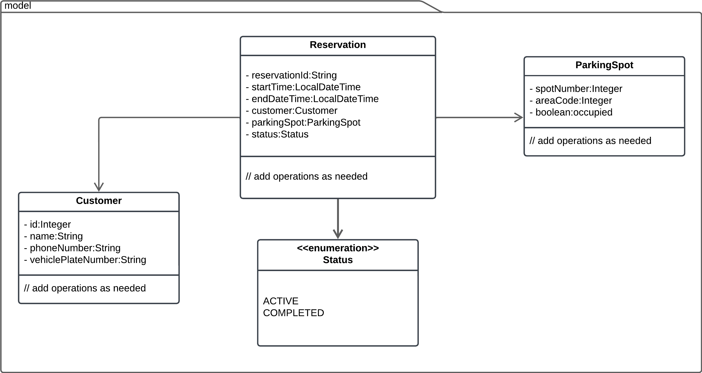
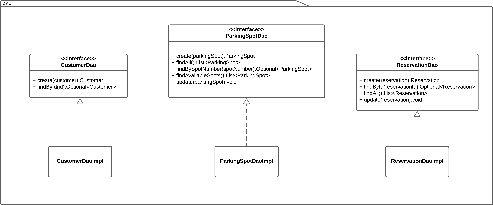

# **Parking App**

## **Objective**

The goal is to implement a **console-based application** using **object-oriented programming (OOP)** principles to
efficiently manage a parking area with multiple parking spots.

The application should allow:

1. **Customer Registration**: Collecting their name and phone number and vehicles plat number.
2. **Display all parking spots**.
3. **Reserve a parking spot for a customer**.
   - Each customer can only reserve one parking spot at a time, provided it is available.
4. **Vacate an occupied parking spot** when a reservation is no longer needed.

### **Key Details**

- **Parking Spots**: Uniquely identified by their **spot number** and **area code** and can transition between vacant and occupied states.
- **Reservations**: Include details such as:
  - Start and end times.
  - The associated customer.
  - The allocated parking spot.

- Data management and persistence should use **Data Access Objects (DAOs)** to keep the code modular and organized,
adhering to OOP principles.

- The application will use a **menu-driven console interface**, offering options for users to:
  - Register customers.
  - Reserve a parking spot.
  - Vacate an occupied parking spot.
  - View parking status.

---

## **Hints**

### **1. Keep it Simple**

- Focus on building one functionality at a time.
- Start small and ensure everything works before adding complexity.
- Build incrementally for better understanding and maintainability.

### **2. Class Diagram**

- Implement and Complete the entities in Java based on the class diagram.
- Ensure each class has appropriate attributes and methods to handle its responsibilities.

### **3. Implement Core Functionalities**

- Start with basic features:
  - Display all parking spots.
  - Register customers.
  - Reserve a parking spot for a customer.
- Gradually add advanced features:
  - Vacate a reserved parking spot.
  - Manage reservations (e.g., updating or extending reservations).

### **4. Data Persistence**

- Use **DAOs** to handle data storage and retrieval.
- Keep the implementation modular for easier maintenance.

### **5. Testing**

- Test each feature as you implement it to ensure correctness.
- Write **unit tests** for critical methods in DAOs and reservation handling.

---

## **Optional Tasks**

- Add new features
- Use **exception handling**
- Use **files or a database** for data persistence
- Use **GUI**

---